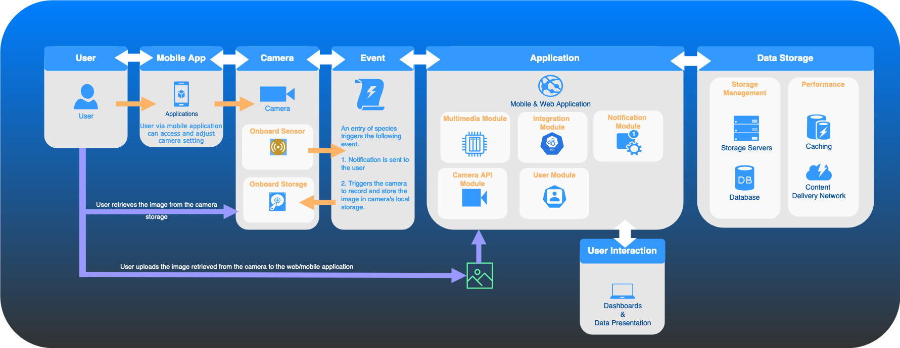
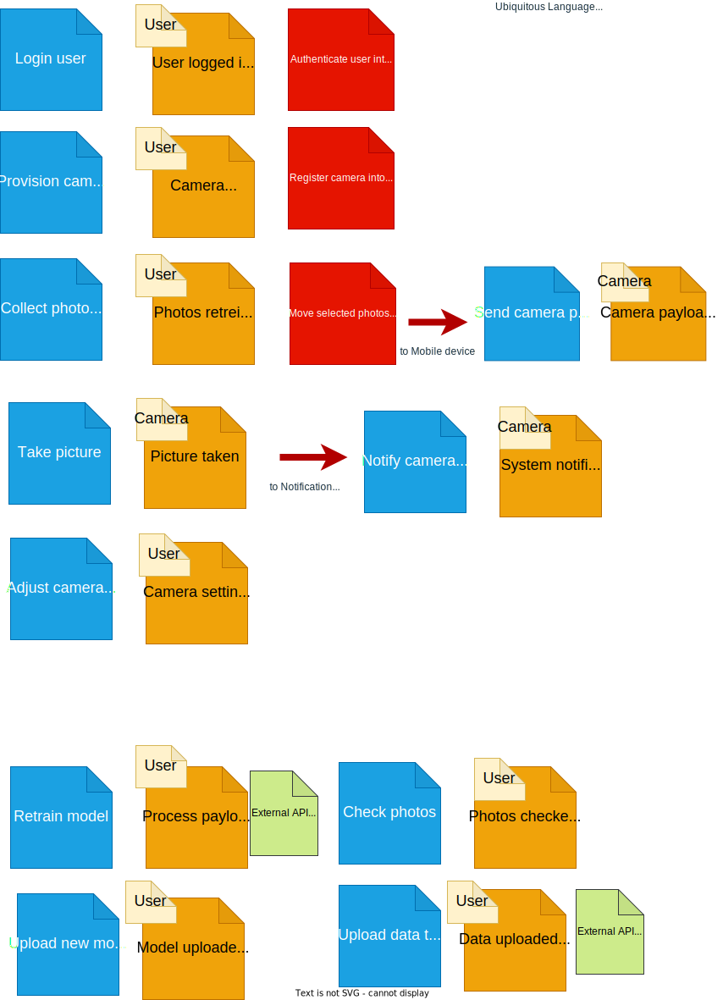
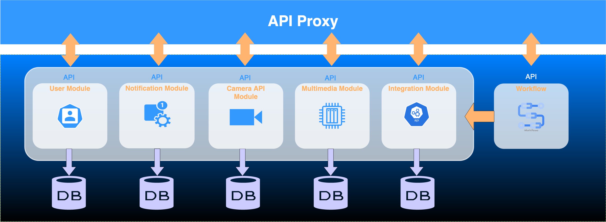

# 1. Wonderous Toys
This is the GitHub repository for a solution created by team Wonderous Toys during the 2023 O'Reilly Architectural Kata. It contains a proposed architecture for Wildlife.ai project for an open-source wildlife camera that will enable more efficient species conservation efforts worldwide.

# 2. Problem Space

## 2.1 Purpose
[Wildlife.ai](https://wildlife.ai/), a charity using AI to accelerate wildlife conservation, wants to build an open-source wildlife cameras that gets triggered based on the movement of target animals, identifies the species on the device and reports the observation in near real-time to biologists, enabling more efficient species conservation efforts worldwide.

## 2.2 Requirements
- Users should be able to communicate with the camera using a mobile app (to set the cameras on/off and adjust settings without opening the cameras)
- Users should be able to analyze the videos using common camera trap labelling platforms [(Wildlife Insights](https://wildlifeinsights.org/), [TrapTagger](https://wildeyeconservation.org/traptagger) or [Trapper](https://gitlab.com/trapper-project/trapper))
- Users should be able to publish frames from the videos to iNaturalist for experts to help with the identification of the species
- Users should be able to easily train edge models, using their own labelled videos, and upload the models to the cameras (maybe using third party services like [Roboflow](https://roboflow.com/), [Edge Impulse](https://edgeimpulse.com/) or [TensorFlow Lite](https://www.tensorflow.org/lite))
- Users should be able to publish the species occurrences to [GBIF](https://www.gbif.org/) using the [Camtrap DP](https://tdwg.github.io/camtrap-dp/), [data exchange format](https://tdwg.github.io/camtrap-dp/)
- Cameras should be able to process the footage on the device and send a small alert message to the users via LoraWan, 3G or satellite

**Additional Context**

The camera hardware will be a combination of ultra-low-power microcontrollers (up to 512KB Flash) and interchangeable modules (e.g. optical sensor, IR lights, transceiver module, batteries) enclosed in a watertight and 3D printed enclosure.

The API for the specific camera hasn’t been selected, allowing teams to specify what behavior they might need from the hardware, helping the team choose appropriate hardware.

## 2.3 High Level Overview

## 2.4 Assumptions
* Camera will be purchased from Wildlife AI partner or User builds it themselves using Wildlife AI open source.
* User can download Mobile App from the stores.
* Any integrations with partners and vendors applications can be configured in the application.
* Internet Access Uncertainty: Internet access cannot be guaranteed in the locations where the cameras will operate. This implies that the data (e.g. videos and models) can only be accessed while in proximity of the camera.
* Financial Constraints: There are budgetary constraints on the project. Financial limitations necessitate cost-effective solutions and careful allocation of resources to ensure the project's sustainability and success.
* Limited User Base: The user base comprises only a few hundred users. Assuming each user will only hava a small number of cameras. Given this relatively small user community, deploying and maintaining a hosted solution could prove burdensome and financially inefficient. It is more practical to assume that mobile devices possessed by the users have sufficient processing power and internet connectivity to handle essential tasks like data uploading and remote camera control.
* Biologists, enthusiasts, and volunteers have different levels of technical know-how. Since many tasks are done by volunteers, it would be great if the solution is simple for anyone to use.
* When we talk about edge computing, it means that your phones and tablets have the ability to both edit and process images.

# 3. Solution Space

## 3.1 Context - Key Drivers

In the pursuit of the charities success, several critical factors stand out as the driving forces propelling Wildlife AI's operations forward. These key drivers encompass the core principles and objectives behind our team's technical solution to guide Wildlife AI's strategies and actions.

**Prototype Testing**

One of the foremost drivers is ability to introduce Wildlife AI's product for the testing of prototypes and ideas. This imperative arises from the desire to observe how Wildlife AI's innovations resonate with a wide spectrum of life forms inhabiting diverse ecosystems, including forests, oceans, and avian habitats. By quickly immersing Wildlife AI's solutions in these diverse environments, invaluable insights are gained into what works and what doesn't. This agile approach enables Wildlife AI to respond promptly to feedback, refining the product based on real-world usage and ensuring its suitability for various species and ecosystems across the globe.

**Species Conservation With Community/Government Collaboration**

Another pivotal driver Wildlife AI is the commitment to species conservation. Wildlife AI actively monitors the well-being and potential endangerment of various species, taking proactive measures when necessary. These actions may include engaging with local communities and collaborating with governmental authorities to protect and preserve threatened species. This reflects their dedication to sustainable practices and environmental protection, aligning core objectives with broader societal and ecological goals.

**Future-ready Integration Support**

In an ever-evolving technological landscape, the ability to adapt and evolve is paramount. Recognizing this, our solutions team is dedicated to enabling Wildlife AI's users to gear towards supporting future growth and innovation through robust integrations. This forward-thinking approach ensures that Wildlife AI's systems remain flexible and adaptable, accommodating emerging trends and technologies. By doing so, Wildlife AI can position itself to stay ahead of the curve and continue providing state-of-the-art solutions to support its mission.

### Summary
In summary, focusing on prototype testing the product, ecological conservation, and future-proofing systems that allow to shape the core values and actions of Wildlife AI the solution our team proposes should meet the needs of Wildlife AI's business today but also anticipate and address the challenges and opportunities of tomorrow.

## 3.2 Architecture Characteristics

After conducting a thorough analysis of Wildlife AI's requirements and key business drivers, we have identified the primary architectural characteristics that the system should incorporate. These key characteristics include Feasibility, Domain Part Abstraction, and Simplicity.

1. **Feasibility:** This architectural attribute ensures that the system's design aligns with the practicality of implementation within the available resources, budget, and time constraints. It underscores the significance of achieving rapid market access and supporting ecological conservation to further Wildlife AI's mission.

2. **Domain Part Abstraction:** The incorporation of domain part abstraction simplifies interactions within the system by hiding complex technical details and providing an intuitive interface with the help of API's. This abstraction streamlines the user experience, making it more user-friendly and reducing the learning curve.

3. **Simplicity:** Simplicity highlights the value of a clear and efficient system design. It advocates for an architecture that is easily comprehensible, user-friendly, and maintainable, ultimately improving overall usability and reducing operational complexity. If the solution is to be open-sourced, it should cater to a broad range of users, spanning from individuals with limited technical knowledge to highly skilled professionals.

Furthermore, we aim to provide the following additional architectural features:

4. **Security:** Furthermore, security being an implicit characteristic, is a crucial part of the system design. We are determined to put strong protections in place to keep all data in our systems safe, making sure data stays private and shielding it from any possible threats.

5. **Interoperability:** Interoperability means that our system can easily talk to and work with the tools and services our partners and vendors use. It helps Wildlife AI users to work well together with partners, vendors, and other ecosystem members to enhance wildlife conservation efforts.

6. **Workflow:** The introduction of workflow capabilities into the system streamlines processes and optimizes the flow of data and actions. It enhances operational efficiency and ensures that tasks are automated and well-coordinated within the solution.

By prioritizing these architectural characteristics, we aim to develop a system that not only aligns with Wildlife AI's current requirements but also offers adaptability for future growth and evolution. Our approach is geared towards delivering a feasible, user-friendly, and secure system that seamlessly interacts with external services and optimizes workflow processes where necessary.

## 3.3 Architecture Style Proposed

Based on the architectural characteristics we've identified, we suggest a combination of **Modular Monolith** and **Micro kernel architecture** to build the application. In this approach, we organize the different aspects of the functionalities into modules and one of these modules uses micro-kernel design. Each of these modules has its own well defined API's that serve as a way for them to communicate with one another and the user interface components. This setup makes sure that the application is well-structured and can efficiently work with different integrations to support the business requirements.

## 3.4 Other Considerations

Additionally, we recognize the importance of the system's ability to adapt and grow, especially when some users in the Wildlife AI's open-source community require more resources than others. In situations like these, as business needs change, the system should be capable of supporting growth by seamlessly scaling, potentially moving one or more services outside of the (modular-monolithic) application ecosystem to microservices. This flexibility guarantees that Wildlife AI's technical setup stays in sync with user's growing mission and operational requirements.

# 4. Domain Design

## Overview 
The Domain Design section of the Wildlife AI architecture outlines the structure and capabilities of various domains that together form a cohesive system for wildlife conservation. Each domain is specialized in its function, catering to different aspects of the overall solution. The design promotes a user-friendly and efficient approach to wildlife conservation, driven by advanced technologies and interdisciplinary expertise.

## Identification Of Domains

## Domain Capabilities In-depth
[User Domain](domain/user-domain.md)

[Multimedia Domain](domain/multimedia-domain.md)

[Notification Domain](domain/notification-domain.md)

[Integration Domain](domain/Integrations-module.md)

# 4.1 Actors Overvew
This shows the relationships between all the Actors in the Wildlife.ai system,

[**Insert diagram of Actors**]

# 5. System Architecture

Our application is designed to meet the [needs](#22-requirements) specified by Wildlife AI, which includes managing users, handling cameras, sending notifications, working with multimedia like photos and videos, and sharing data with our partners and vendors. To make it organized, we've assigned each domain to its own module in our proposed solution.

In addition to these domain modules, we've created a special module called the workflow module. This module can help us do complicated tasks automatically. For example, when we need to send media data to a third-party partner for their edge modeling work, it involves lots of steps like making multiple API calls and preparing the data in a specific way.

## 5.1 Core Components of System Architecture

### User module
The primary responsibility of the user module is managing user accounts and information that's specific to each user. People using the application can create their accounts, log in (optionally), and view their profiles, which makes the whole experience more personalized for them. Additionally, within this module, users can choose their notification preferences to decide how they want to be notified about things in the app. This way, users have control over their interaction with the application. Additionally, they can invite other users who would like to participate in the project.

### Notification module
This module takes care of sending various types of notifications to users, enhancing their interaction with the application.

### Camera module
The Camera Module within our modular monolith architecture primarily serves as the interface to connect with the API provided by the Wildlife AI cameras. This allows users to adjust camera settings while they are using our application when they are physically close to the camera location.
In this module, we keep very little information about the user essentially retaining only a unique user identifier associated with the camera's owner.
Furthermore, this module provides the functionality to configure where notifications should be sent when the camera detects a wildlife species. Users can set their preferred notification endpoint, ensuring they are promptly informed when wildlife is spotted.

### Multimedia module
Multimedia module encompasses handling image and video data once they are retrieved from camera. In our application, this means that users can upload, store, retrieve, and take notes about the wildlife species they spotted in the images or videos. This module is essential because it deals with the core media files that our application relies on for integrations with other partners and vendors. If necessary, we can use CDN and other caching methods to bring data closer to the user to speed things up and make the data load faster.

### Integration module
The Integrations module allows Wildlife AI camera users to connect with various services, like camera trap labelling and expert platforms, and data sharing with the community. It achieves this by making individual plugins for each integration, making it adaptable and future-ready for adding more plugins. These plugins connect with partner APIs and help manage data interchange among partner APIs. This module uses a micro kernel architecture to support the interoperability characteristic.

### Workflow module
The Workflow module exposes APIs designed to efficiently manage and coordinate tasks across all the above modules within the Wildlife AI application to support certain expensive use cases.

# Long Term Expansions
* User purchasing can be done in the same portal
* Create and coordinate projects in the portal for community togetherness
* Sucess metrics of the camera
* Build strict boundaries so there is no direct communication between modules

# ADR's
The linked ADRs contain the primary architectural decisions regarding the proposed design, including their context and rationale.

[ADR 001](ADRs/ADR001-EventDriven.md) Event-Driven Camera Alerts

[ADR 002](ADRs/ADR002-ModularMonolith.md) Modular monolith architecture

[ADR 003](ADRs/ADR003-Processing%20with%203rd%20Parties%20and%20Edge%20Computing) Processing with 3rd Parties and Edge Computing

[ADR 004](ADRs/ADR004%20-%20Ease%20of%20Use%20-%20Mobile%20App%20Only.md) Easy of Use

[ADR 005](ADRs/ADR005%20-%20Integrations.md) Integrations

# References
1. Software Architecture Patterns, 2nd Edition by Mark Richards
2. https://www.kamilgrzybek.com/blog/posts/modular-monolith-domain-centric-design
3. Architecture style worksheet https://www.developertoarchitect.com/downloads/architecture-styles-worksheet.pdf
4. https://github.com/Sairyss/domain-driven-hexagon
