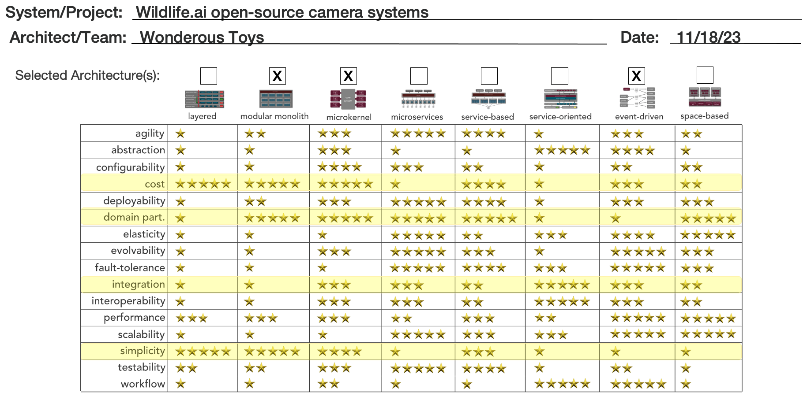

TABLE OF CONTENTS <!-- omit from toc --> 
=================
- [1. Welcome to Wonderous Toys](#1-welcome-to-wonderous-toys)
- [2. Problem Space](#2-problem-space)
    - [Wildlife Watcher](#wildlife-watcher)
    - [Objective](#objective)
    - [Users](#users)
    - [System Requirements](#system-requirements)
    - [Constraints and Assumptions](#constraints-and-assumptions)
- [3. Solution Space](#3-solution-space)
  - [3.1 Context - Key Drivers](#31-context---key-drivers)
    - [Summary](#summary)
  - [3.2 Architecture Characteristics](#32-architecture-characteristics)
  - [3.3 Architecture Style Proposed](#33-architecture-style-proposed)
  - [3.4 Other Considerations](#34-other-considerations)
- [4. Domain Design](#4-domain-design)
  - [Overview](#overview)
  - [Identification Of Domains](#identification-of-domains)
  - [Domain Capabilities In-depth](#domain-capabilities-in-depth)
- [5. System Architecture](#5-system-architecture)
  - [5.1 Core Components of System Architecture](#51-core-components-of-system-architecture)
    - [User module](#user-module)
    - [Notification module](#notification-module)
    - [Camera module](#camera-module)
    - [Multimedia module](#multimedia-module)
    - [Integration module](#integration-module)
    - [Workflow module](#workflow-module)
- [Long Term Expansions](#long-term-expansions)
- [ADR's](#adrs)
- [References](#references)

# 1. Welcome to Wonderous Toys
This is the GitHub repository for a solution created by team Wonderous Toys during the [2023 O'Reilly Architectural Kata](https://learning.oreilly.com/featured/architectural-katas/). It contains a proposed architecture for [Wildlife.ai](https://wildlife.ai/) project for an open-source wildlife camera that will enable more efficient species conservation efforts worldwide.

This solution emphasizes:
- **Simplicity**: Mobile first, simple Pub/Sub for Notifications, significant control for local camera owners
- **Frugality**: Few and small recurring infrastructure charges, Modular monolith when we need it. Pre-existing use of  users' mobile devices.
- **Autonomy**: Mobile app and Event-driven pieces could be lifted and shifted into contaners and could be hosted locally (Bring-Your-Own-Cloud) by the user if needed (100% email Notification or Mesh networking if needed)

# 2. Problem Space

### Wildlife Watcher
[Wildlife.ai](https://wildlife.ai/) is a charitable trust that utilizes artificial intelligence to expedite wildlife conservation. Collaborating with grassroots wildlife conservation projects, they develop open-source solutions employing machine learning to accelerate conservation efforts. Additionally, they organize community events, seminars, and educational activities aimed at creating and maintaining machine-learning solutions to reduce the current rate of species extinction.

### Objective
The project aims to build an open-source wildlife camera that:
* Triggers based on the movement of target animals,
* Employs an AI model to identify captured species,
* Reports observations in near real-time to biologists or other users.

### Users
The intended users of the project include:

* Biologists
* Nature Enthusiasts

### System Requirements

* Users should be able to communicate with the camera using a mobile app,
  * To set the cameras on/off,
  * Adjust settings without opening the cameras
* Users should be able to analyze the videos using common camera trap labelling platforms.
  * [Wildlife Insights](https://wildlifeinsights.org/), [TrapTagger](https://wildeyeconservation.org/traptagger) or [Trapper](https://gitlab.com/trapper-project/trapper)
* Users should be able to publish frames from the videos to [iNaturalist](https://www.inaturalist.org/) for experts to help identify the species.
* Users should be able to train edge models easily
  * Using their own labelled videos and uploading the models to the cameras
  * Using third-party services [Roboflow](https://roboflow.com/), [Edge Impulse](https://edgeimpulse.com/) or [TensorFlow Lite](https://www.tensorflow.org/lite)
* Users should be able to publish the species occurrences to
  * [GBIF](https://www.gbif.org/) using the [Camtrap DP](https://tdwg.github.io/camtrap-dp/), [data exchange format](https://tdwg.github.io/camtrap-dp/)
* Cameras should be able to process the footage on the device and send a small alert message to the users via
  * LoraWan, 3G or satellite.

### Constraints and Assumptions

The project operates within specific constraints:

1. <a name="charitable">Wildlife ai operates as a charitable trust</a>
> Assumption: Wildlife ai being a charitable trust we assume there will be budgetary constraints for this project. Financial limitations necessitate cost-effective solutions and careful allocation of resources to ensure the project's sustainability and success.
2. <a name="opensource">Wildlife AI wants to build an open-source camera integrated with artificial intelligence for species conservation efforts.</a>
> Assumption:  The software solution serves as an add-on to the camera, facilitating data sharing with various platforms, enthusiasts, and biologists. Both the camera and the accompanying software will be open-source, catering to users with varying levels of technical expertise.
3. <a name="camerahw">Camera hardware specifications:</a>
  * Ultra-low-power microcontrollers (up to 512KB Flash)
  * Comprising of interchangeable modules (e.g., optical sensor, IR lights, transceiver module, batteries) within a watertight 3D-printed enclosure.
4. <a name="cameraacq">Camera Acquisition:</a>
> Assumption: Camera will be purchased from Wildlife AI, partner, or User builds it themselves using Wildlife AI open source.
5. <a name="mobileapp">Mobile App Installation:</a>
> Assumption: Users can download Mobile App from the app stores.
6. <a name="integrations"> Integrations with Wildlife Insights, iNaturalist, Roboflow, GBIF etc.,:</a>
> Assumption: Any integrations with partners and vendors applications can be configured in the application.
7. <a name="internet"> Internet Access Uncertainty: 
> Assumption: Internet access cannot be guaranteed in the locations where the cameras will operate. This implies that the data (e.g. videos and models) can only be accessed while in proximity of the camera.
5. <a name="userbase"> User Base: The user base comprises only a few hundred users and is spread globally.</a>
> Assumption: Each user will only have a small number of cameras. Given this relatively small user community, deploying and maintaining a hosted solution could prove burdensome and financially inefficient.
6. <a name="userexpertise">User skill sets:</a>
> Assumption: Biologists, enthusiasts, and volunteers have different levels of technical know-how. Since many tasks are done by volunteers, it would be great if the solution is simple for anyone to use.
7. <a name="devicecomp">User Device capability:</a>
> Assumption: Mobile devices possessed by the users have sufficient processing power and internet connectivity to handle essential tasks like edit & process images, data uploading and remote camera control.

# 3. Solution Space

## 3.1 Context - Key Drivers

In the pursuit of the charity's success, several critical factors stand out as the driving forces propelling Wildlife AI's operations forward. These key drivers encompass the core principles and objectives behind our team's technical solution to guide Wildlife AI's strategies and actions.

**Prototype Testing**

One of the foremost drivers is the ability to introduce Wildlife AI's product for the testing of prototypes and ideas. This imperative arises from the desire to observe how Wildlife AI's innovations resonate with a wide spectrum of life forms inhabiting diverse ecosystems, including forests, oceans, and avian habitats. By quickly immersing Wildlife AI's solutions in these diverse environments, invaluable insights are gained into what works and what doesn't. This agile approach enables Wildlife AI to respond promptly to feedback, refining the product based on real-world usage and ensuring its suitability for various species and ecosystems across the globe.

**Species Conservation With Community/Government Collaboration**

Another pivotal driver of Wildlife AI is the commitment to species conservation. Wildlife AI actively monitors the well-being and potential endangerment of various species, taking proactive measures when necessary. These actions may include engaging with local communities and collaborating with governmental authorities to protect and preserve threatened species. This reflects their dedication to sustainable practices and environmental protection, aligning core objectives with broader societal and ecological goals.

**Future-ready Integration Support**

In an ever-evolving technological landscape, the ability to adapt and evolve is paramount. Recognizing this, our solutions team is dedicated to enabling Wildlife AI's users to gear towards supporting future growth and innovation through robust integrations. This forward-thinking approach ensures that Wildlife AI's systems remain flexible and adaptable, accommodating emerging trends and technologies. By doing so, Wildlife AI can position itself to stay ahead of the curve and continue providing state-of-the-art solutions to support its mission.

### Summary
In summary, focusing on prototype testing the product, ecological conservation, and future-proofing systems that allow to shape the core values and actions of Wildlife AI the solution our team proposes should meet the needs of Wildlife AI's business today but also anticipate and address the challenges and opportunities of tomorrow.

## 3.2 Architecture Characteristics

After conducting a thorough analysis of Wildlife AI's [requirements](#22-requirements) and key business drivers, we have identified the primary architectural characteristics that the system should incorporate. These key characteristics include Feasibility, Simplicity, Domain Part Abstraction and Interoperability.

1. **Feasibility/Cost-effective:** This architectural attribute ensures that the system's design aligns with the practicality of implementation within the available resources, budget, and time constraints.
> Based on the financial constraints of being a charitable trust and to support the open-source initiative we want to propose a cost-effective solution.
[#charity](#charitable)
[#open source initiative](#opensource)

2. **Simplicity:** Highlights the value of a clear and efficient system design. It advocates for an architecture that is easily comprehensible, user-friendly, maintainable and ultimately improving overall usability and reducing operational complexity.
> The users who will be interacting with the system can have limited technical skillset, and given Wildlife AI support open-source initiative, we have preferred to design a solution that is simple to use and maintain.
[#technical skill set](#userexpertise)
[#open source initiative](#opensource)

3. **Domain Part Abstraction:** The abstraction of domain components paves a path for a straightforward and intelligible foundation when building the software solution for open-source users. Each module is self-contained and easily comprehensible. 
> Although not explicitly specified in the requirements, the abstraction of domain components has emerged as an implicit necessity to facilitate future scalability for the intended user base.
>
> For those seeking a solution that can be built upon existing functionalities, the abstraction of domain components provides a robust groundwork.
>
> In the event the community's requirements (Wildlife ai or its open-source users) surpass the initial setup, these domains can be extracted and implemented as services to accommodate scalability.

4. **Interoperability:** Interoperability ensures that our system can seamlessly communicate with and function alongside the tools and services deployed by Wildlife's partners and vendors. It helps Wildlife AI users to work well together with partners, vendors, and other ecosystem members to enhance wildlife conservation efforts.
> Based on the requirements, the system should be able to interact with the third party applications.
[#system requirements](#system-requirements)
[#open source initiative](#opensource)

Furthermore, we aim to provide the following additional architectural features:

5. **Security:** Being an implicit characteristic, it is a crucial part of any software system design. We are determined to put strong protections in place to keep all data in our systems safe, making sure data stays private and shielding it from any possible threats.

6. **Workflow:** With the need to integrate with multiple third party applications, the system could incorporate workflow capabilities to support complex processes, optimizes the flow of data and actions. This ensures that tasks are automated and well-coordinated within the solution

By prioritizing these architectural characteristics, we aim to develop a system that not only aligns with Wildlife AI's current requirements but also offers adaptability for future growth and evolution. Our approach is geared towards delivering a feasible, user-friendly, and secure system that seamlessly interacts with external services and optimizes workflow processes where necessary.

## 3.3 Architecture Style Proposed

Based on the architectural characteristics we've identified, we suggest a combination of **Modular Monolith**, **Micro kernel**, and **Event-Driven** architectures to build the application. See the image below with the mapping between architecture characteristics mentioned above and the Architecture Styles proposed in this solution. In this approach, we organize the different aspects of the functionalities into modules and one of these modules uses micro-kernel design. Each of these modules has its own well defined API's that serve as a way for them to communicate with one another and the user interface components. In addition, to address the near-real time communication request of this problem and its constraint of uncertain internet access, the event-driven architecture can successfully address the needs. This setup makes sure that the application is well-structured and can efficiently work with different integrations to support the business requirements.

## 3.4 Other Considerations

Additionally, we recognize the importance of the system's ability to adapt and grow, especially when some users in the Wildlife AI's open-source community require more resources than others. In situations like these, as business needs change, the system should be capable of supporting growth by seamlessly scaling, potentially moving one or more services outside of the (modular-monolithic) application ecosystem to microservices. This flexibility guarantees that Wildlife AI's technical setup stays in sync with user's growth and operational requirements.

# 4. Domain Design

## Overview
Using domain-driven design at the simplest level, we identified the domains and user flows essential for meeting the requirements of Wildlife AI.

## Identification Of Domains

## Domain Capabilities In-depth
This exercise helped us identify crucial components that must be developed to create a comprehensive solution. Each component is designed to support a specific functionality, aligning with the Single Responsibility Principle (SRP). This approach ensures that each component within the system has a clearly defined and singular purpose, contributing to a more modular design.

[User Domain](domain/user-domain.md) places users at the forefront of the system and encompasses functionalities such as user profile management and authentication. It is responsible for storing and managing user profile information, ensuring secure authentication processes, and storing user preferences, including their alert settings and the camera devices they own.

[Camera Domain](domain/camera-domain.md) acts as an interface to connect to the Wildlife AI cameras with our mobile app, letting the app control the camera settings.

[Multimedia Domain](domain/multimedia-domain.md) enables to collect and keep photos and videos from Wildlife AI cameras. This domain allows the mobile app to smoothly save and organize the pictures and videos taken by the cameras. It makes it easy for users to store, find, and look at the images and videos captured by the Wildlife AI cameras through the app. This domain makes the app more user-friendly and valuable for people who want to manage and view multimedia content.

[Notification Domain](domain/notification-domain.md) enables the Wildlife AI cameras to send short notifications to the mobile app.

[Integration Domain](domain/Integrations-module.md) serves as a crucial bridge connecting the Wildlife AI business with a diverse spectrum of services and platforms.

## Summary
Through this iterative domain identification and user flow analysis, we established a robust foundation for developing the core features of the Wildlife AI system.

# 5. System Architecture

Our application is designed to meet the [needs](#22-requirements) specified by Wildlife AI, which includes managing users, handling cameras, sending notifications, working with multimedia like photos and videos, and sharing data with our partners and vendors. To make it organized, we've assigned each domain to its own module in our proposed solution.

In addition to these domain modules, we've created a special module called the workflow module. This module can help us do complicated tasks automatically. For example, when we need to send media data to a third-party partner for their edge modeling work, it involves lots of steps like making multiple API calls and preparing the data in a specific way.

## 5.1 Core Components of System Architecture

### User module
The primary responsibility of the user module is managing user accounts and information that's specific to each user. People using the application can create their accounts, log in (optionally), and view their profiles, which makes the whole experience more personalized for them. Additionally, within this module, users can choose their notification preferences to decide how they want to be notified about things in the app. This way, users have control over their interaction with the application. Additionally, they can invite other users who would like to participate in the project.

### Notification module
The Notification Module serves as a vital component within the Wildlife AI system, facilitating the seamless delivery of near real-time and relevant notifications to users. It plays a crucial role in timely camera nofitications and ensuring that users stay informed about significant events detected by the Wildlife AI cameras.
This module is responsible for sending instant alert notifications to users when a Wildlife AI camera detects the presence of target wildlife species. The notifications are designed to be concise, providing users with essential information about the detected species.
In addition, users can configure to receive important camera notifications such as battery alerts and other similar issues.

### Camera module
The Camera Module within our modular monolith architecture primarily serves as the interface to connect with the API provided by the Wildlife AI cameras. This allows users to adjust camera settings while they are using our application when they are physically close to the camera location.
In this module, we keep very little information about the user essentially retaining only a unique user identifier associated with the camera's owner.
Furthermore, this module provides the functionality to configure where notifications should be sent when the camera detects a wildlife species. Users can set their preferred notification endpoint, ensuring they are promptly informed when wildlife is spotted.

### Multimedia module
Multimedia module encompasses handling image and video data once they are retrieved from a camera. In our application, this means that users can upload, store, retrieve, and take notes about the wildlife species they spotted in the images or videos. This module is essential because it deals with the core media files that our application relies on for integrations with other partners and vendors. If necessary, we can use CDN and other caching methods to bring data closer to the user to speed things up and make the data load faster.

### Integration module
The Integrations module allows Wildlife AI camera users to connect with various services, like camera trap labelling and expert platforms, and data sharing with the community. It achieves this by making individual plugins for each integration, making it adaptable and future-ready for adding more plugins. These plugins connect with partner APIs and help manage data interchange among partner APIs. This module uses a micro kernel architecture to support the interoperability characteristic.

### Workflow module
The Workflow module exposes APIs designed to efficiently manage and coordinate tasks across all the above modules within the Wildlife AI application to support certain expensive use cases.

# Long Term Expansions
As we envision the future evolution of the Wildlife.ai solution, we anticipate several long-term expansions that aim to enhance user experience, community collaboration, and overall system effectiveness.

* Over time, additional features and integrations can be introduced through mobile app plugins. These plugins will utilize REST APIs to seamlessly connect with third-party services, providing users with a broader range of functionalities and options.
* Introducing a user portal for purchasing allows users to conveniently acquire additional features, plugins, or even hardware components. This portal serves as a centralized hub for users to manage their subscriptions, make purchases, and explore new offerings.
* A dedicated portal for creating and coordinating projects fosters community togetherness. Users can collaborate on wildlife conservation initiatives, share insights, and collectively contribute to the success of specific projects.
* Implementing a system to track and analyze success metrics of the wildlife cameras enhances the monitoring and evaluation process. Metrics such as species identification accuracy, camera uptime, and data contribution to conservation databases can be measured.
* Future focus on evolving the open-source ecosystem by encouraging community contributions, fostering developer engagement, and actively seeking partnerships with other open-source projects with wildlife conservation interests.

These long-term expansions align with our commitment to continuous improvement, adaptability to user needs, and the promotion of a collaborative and user-centric ecosystem within the Wildlife.ai project.

# ADR's
The linked ADRs contain the primary architectural decisions regarding the proposed design, including their context and rationale.

[ADR 001](ADRs/ADR001-EventDriven.md) Event-Driven Camera Alerts proposes implementing an event-driven architecture for camera alerts to address challenges with limited internet access and email delivery, utilizing a service similar to Google's GCP Pub/Sub for reliable and cost-effective alert communication

[ADR 002](ADRs/ADR002-ModularMonolith.md) Modular monolith architecture proposes using the modular monolith architecture style to develop the application, ensuring ease of understanding, building, deploying, and modifying while being cost-effective and flexible in design.

[ADR 003](ADRs/ADR003-Processing%20with%203rd%20Parties%20and%20Edge%20Computing.md) Processing with 3rd Parties and Edge Computing proposes moving data processing to 3rd parties and leveraging edge computing for the Wildlife.ai project to enhance cost efficiency, sustainability, scalability, and data security while simplifying the architecture.

[ADR 004](ADRs/ADR004%20-%20Ease%20of%20Use%20-%20Mobile%20App%20Only.md) Easy of Use proposes the use of a mobile app as the primary interaction model for Wildlife.ai.

[ADR 005](ADRs/ADR005-MicroKernel.md) Micro kernel architecture to connect with other partners and vendors.

[ADR 006](ADRs/ADR006-OpenSolution.md) To align with the ethos of transparency, community involvement, and enabling a broader impact on conservation efforts.

# References
1. [Software Architecture Patterns, 2nd Edition by Mark Richards](https://learning.oreilly.com/library/view/software-architecture-patterns/9781098134280/)
2. [Modular monolith: domain-centric design](https://www.kamilgrzybek.com/blog/posts/modular-monolith-domain-centric-design)
3. [Architecture style worksheet](https://www.developertoarchitect.com/downloads/architecture-styles-worksheet.pdf)
4. [Domain-Driven Hexagon](https://github.com/Sairyss/domain-driven-hexagon)