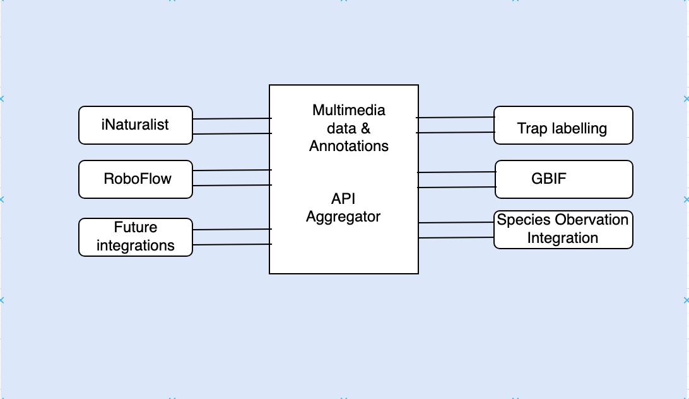

# Integrations Module: Bridging Business with Partners and Vendors

The Integrations module serves as a crucial bridge connecting the Wildlife AI business with a diverse spectrum of services and platforms. It establishes connections with tools such as camera trap labeling solutions like Wildlife Insights, facilitates collaboration with experts through platforms like iNaturalist, aids in training edge model services like TensorFlow Lite, and enables the sharing of data with the broader community via platforms like GBIF.

The architectural foundation of this module is deeply rooted in the concept of a micro-kernel, which provides the necessary flexibility and extensibility to support a wide array of integrations. By isolating distinct integration logic and the specific data formats required to process business requests, it streamlines interactions with the extensive ecosystem of services. This approach ensures that the Wildlife AI business remains agile and well-prepared to engage with an ever-evolving landscape of services and platforms.

## Components

### Plugins

Each integration with partners and vendors is encapsulated within an individual plugin, with each plugin exposing its distinctive set of APIs. Internally, these plugins are configurable, enabling them to efficiently communicate with their respective partner APIs and function as adapters for data manipulation when exchanging information between multimedia data and partner APIs. The module is constructed to seemlesly accommodate future integrations, facilitating the incorporation of new plugins into the ecosystem.

### Core System
Core system has two responsbilities

#### 1. Image/Video Display and Markup

The Integrations module serves as a framework for displaying multimedia images and adding annotations to data before sharing with other partners. These components play a crucial role in allowing users to access and work with primary datasets within our application. It makes it easy to get images or videos from our internal API and share their associated information as needed with partners.

#### 2. API Aggregator

The Integrations module also takes on the responsibility of aggregating all APIs into a unified interface, enabling UI components to communicate and display data in a consistent manner. This aggregation ensures that data is presented to users as designed, allowing them to view and interact with it seamlessly. This centralization of APIs simplifies the complexity of identifying plugins and handling data from diverse sources, streamlining the user experience and making it more efficient.

## Related ADRs
[ADR 006 Microkernel](../ADRs/ADR006-MicroKernel.md)

## Summary
In summary, the Integrations module is the backbone of Wildlife AI's integration strategy, ensuring that Wildlife AI can effectively collaborate with partners and vendors, both now and in the future. Its micro-kernel architecture and the dual roles of API aggregation and image viewing with annotations capability make it a crucial part of the system, enhancing Wildlife AI's ability to harness the power of external services while maintaining a cohesive and efficient user experience.