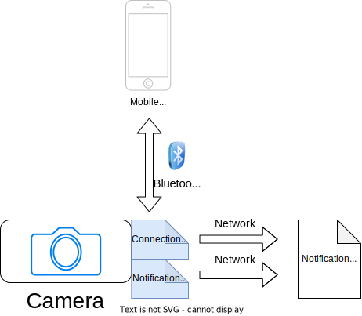

# Camera Domain: Notification When Idenitification happens

The Camera domain allows the Camera to communicate with the Notification Domain to alert the Users when a photo is identified

Our design recommends the use of a simple email message that is sent to the Notification endpoint

## Components
- A network connection to send out the message immediately
- A file system to store the "identification payload" and possibly the message if the camera is offline at the time

### Plugins
- An SMTP plugin if they choose to communicate via email.
- An HTTP plugin to handle any other URL based endpoint.

### Core System
- A networking stack that can handle SMTP or HTTP

#### 1. Connection service
The connection service configures, authorizes and stores the information the Camera needs to communicate with the Notificiation system.

#### 2. Messaging Service
Two types of messages need to be able to be handled
- Identification Notification
    - This is the primary function: Sending a payload of the species identified + metadata about the image. This shoudl be the smae payload that the mobile device recieves, minus the actual picture.
- Status
    - Sends a message indicating some status condition like:
        - Any errors
        - Battery low
        - SD card full
        - Camera moving / tilt detection 
            - Simple lo-jack capabilities for theft prevention or notification that the camera has fallen over

## Related ADRs

[ADR 001 - Event Driven Notifications](../ADRs/ADR001-EventDriven.md "Event Driven Notifications")

## Summary
In summary, the Camera domain is the primary way the camera provides Notifications about important events happening at the Camera that Users are interested in.
